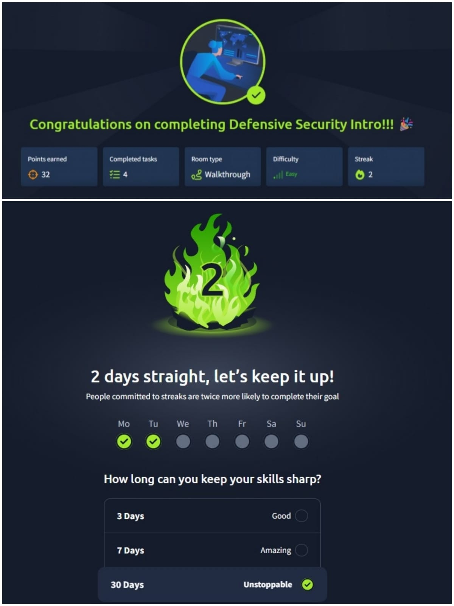
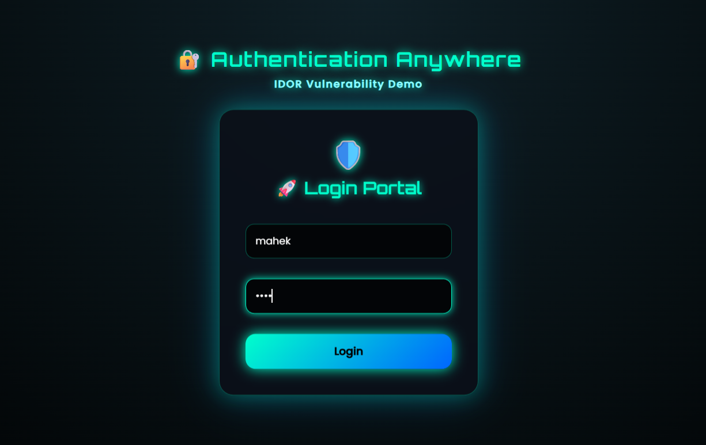
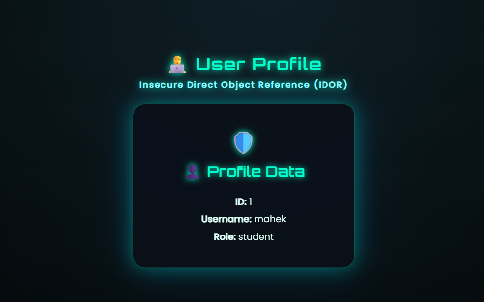
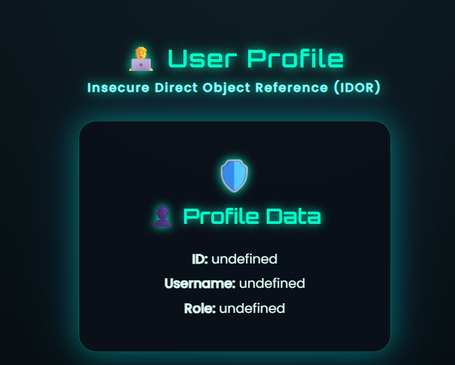

# 🔐 Secure Profile Viewer — Module 1 (TryHackMe)

A **hands-on mini project** to strengthen understanding of **web security**, authentication, and authorization. This project demonstrates **Insecure Direct Object Reference (IDOR)** using a simple login and profile-based system.

---

## 🏆 TryHackMe Achievement

**TryHackMe – Module 1 Completed ✅**



This module helped me build a strong foundation in:
- Web vulnerabilities
- Defensive security concepts
- Authentication & authorization basics

---

## 📌 Project Overview

- Implemented **login & profile-based access**
- Explored **IDOR vulnerability**
- Learned the difference between **authentication vs authorization**
- Designed a **cyber-themed UI** to visualize vulnerabilities

---

## 🖼️ Project Screenshots

**1️⃣ Login Page**  


**2️⃣ Profile Page**  


**3️⃣ IDOR Demonstration**  


---

## 🛠️ Tech Stack

- **Frontend:** HTML, CSS, JavaScript  
- **Backend:** PHP / Node.js  
- **Database:** MySQL / SQLite  

---

## 💻 Features

- Secure login & user authentication
- Profile access based on **user ID**
- IDOR vulnerability demonstration for learning purposes
- Cyber-themed UI for better visualization

---

## 🚀 Getting Started

1. Clone the repository:

```bash
git clone https://github.com/mahekkalka/secure-profile-viewer_module1.git
